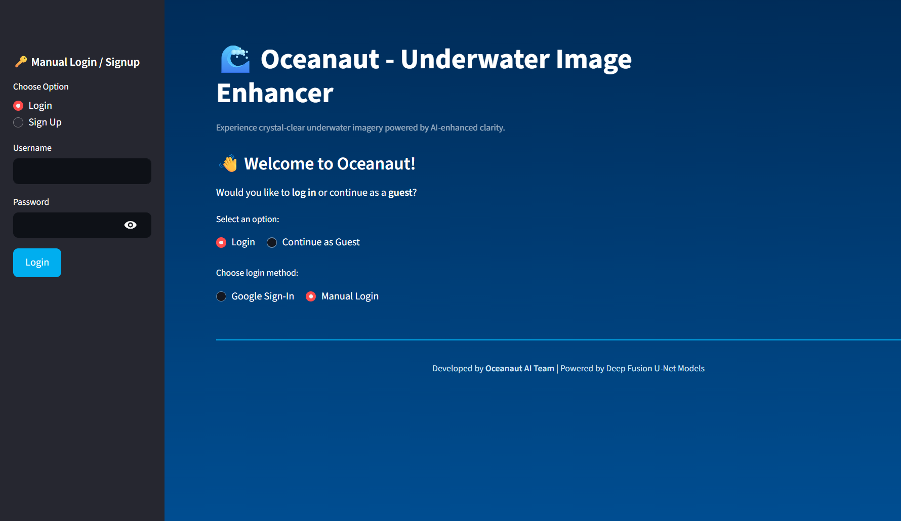
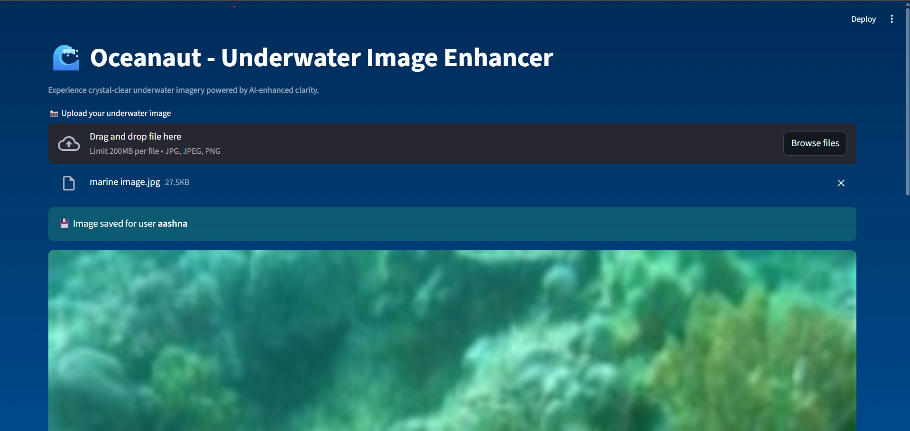
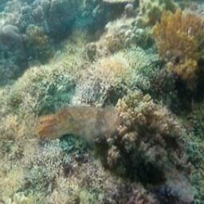

# 🌊 Oceanaut: Underwater Image and Video Enhancement App

**Oceanaut** is a deep learning–powered Streamlit application built to enhance underwater images and videos.  
It fuses outputs from multiple **Enhanced U-Net models** to restore natural colors, contrast, and clarity to underwater visuals.  
The app features **Google Sign-In authentication via Firebase**, ensuring secure and seamless user access.

---

## 🚀 Features
- 🧠 Deep Learning–based underwater image and video enhancement  
- 🔄 Fusion of multiple Enhanced U-Net models for superior visual quality  
- ⚡ Real-time image and video processing through **Streamlit**  
- 🔐 **Google Sign-In using Firebase Authentication**  
- 🎥 Side-by-side comparison of original and enhanced outputs  
- 💻 GPU acceleration support (PyTorch + CUDA compatible)

---

## 🖥️ App Preview

### 🔹 Login Screen (Google Sign-In)


### 🔹 Home Screen


### 🔹 Enhancement Output


---

## ⚙️ Installation & Setup

### 1️⃣ Clone the Repository
```bash
git clone https://github.com/<org-or-username>/oceanaut.git
cd oceanaut
````

### 2️⃣ Create a Virtual Environment

```bash
python -m venv venv
# Activate it
venv\Scripts\activate      # (Windows)
source venv/bin/activate   # (Mac/Linux)
```

### 3️⃣ Install Requirements

```bash
pip install -r requirements.txt
```

---

## 🔐 Firebase Setup (Google Sign-In)

1. Go to [Firebase Console](https://console.firebase.google.com/).
2. Create a new project called **Oceanaut**.
3. Navigate to **Authentication → Sign-in Method → Enable Google**.
4. In **Project Settings → General → Web App Config**, copy your credentials and add them to a `.env` file or Streamlit secrets:

   ```
   FIREBASE_API_KEY = "your_api_key"
   FIREBASE_AUTH_DOMAIN = "your_project.firebaseapp.com"
   FIREBASE_PROJECT_ID = "your_project_id"
   FIREBASE_STORAGE_BUCKET = "your_project.appspot.com"
   FIREBASE_MESSAGING_SENDER_ID = "your_sender_id"
   FIREBASE_APP_ID = "your_app_id"
   ```
5. The app will automatically use these credentials for Google authentication.

---

## ▶️ Run the App

```bash
streamlit run streamlit_app.py
```

Once launched:

* Sign in using your **Google account**
* Upload an underwater image or video
* Click **Enhance** to view before and after results

---

## 🧰 Technologies & Tools Used

| Category                   | Tools                                 |
| -------------------------- | ------------------------------------- |
| **Frontend**               | Streamlit                             |
| **Backend / ML**           | PyTorch, OpenCV, NumPy                |
| **Authentication**         | Firebase, Google Sign-In              |
| **Frameworks / Libraries** | scikit-image, Torchvision             |
| **Language**               | Python 3.10+                          |
| **Deployment Options**     | Streamlit Cloud / Hugging Face Spaces |

---

## ☁️ Firebase Integration

* 🔐 Secure Google-based user authentication
* ⚙️ Real-time user session management
* ☁️ Can be extended to store enhanced results per user in Firebase Storage
* 🧭 Simplifies access control and improves user experience

---

## 📜 License

This project is licensed under the **MIT License** — free to use and modify for research and educational purposes.

---

**✨ Collaboratively developed to bring clarity back to the deep.**
